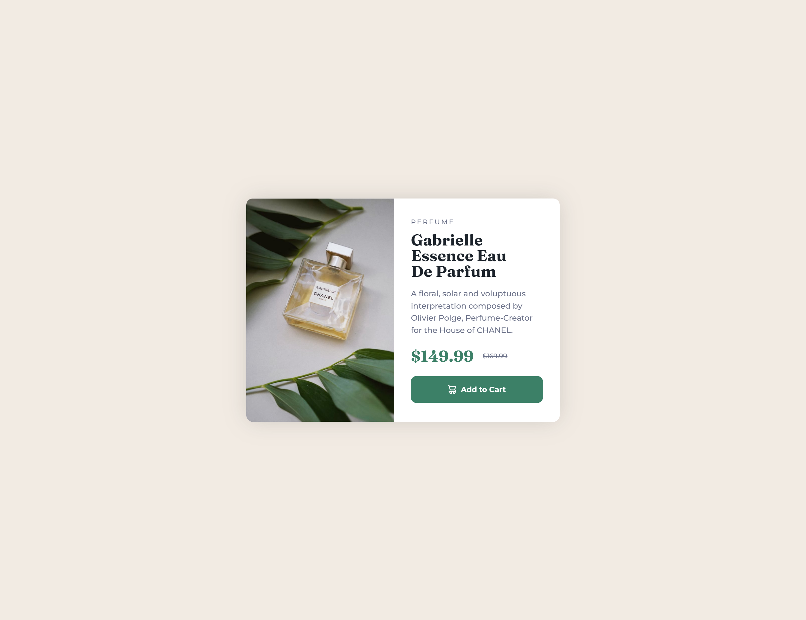

# Frontend Mentor - Product preview card component solution

This is a solution to the [Product preview card component challenge on Frontend Mentor](https://www.frontendmentor.io/challenges/product-preview-card-component-GO7UmttRfa). Frontend Mentor challenges help you improve your coding skills by building realistic projects.

## Table of contents

-   [Overview](#overview)
    -   [Screenshot](#screenshot)
    -   [Links](#links)
-   [My process](#my-process)
    -   [Built with](#built-with)
    -   [What I learned](#what-i-learned)
    -   [Continued development](#continued-development)
    -   [Useful resources](#useful-resources)
-   [Author](#author)

## Overview

### Screenshot




### Links

-   Solution URL: (https://github.com/Ao-chi/product-preview-card-component-main.git)
-   Live Site URL: (https://product-preview-card-component-main-2.netlify.app/)

## My process

### Built with

-   Sass
-   Flexbox
-   Mobile-first workflow
-   [React](https://reactjs.org/) - JS library

**Note: These are just examples. Delete this note and replace the list above with your own choices**

### What I learned

In this challenge I learned to use props and breaking down a component into much more smaller components.

```js
const CardBody = (props) => {
    console.log(props.tag);
    return (
        <div className="card-body">
            <div className="tag">
                <p>{props.tag}</p>
            </div>
            <div className="card-title">
                <h1>{props.title}</h1>
            </div>
            <div className="card-desc">
                <p>{props.text}</p>
            </div>
            <div className="item-price">
                <p className="price">${props.price}</p>
                <span className="orig-price">${props.origPrice}</span>
            </div>
            <Button />
        </div>
    );
};

export default CardBody;
```

If you want more help with writing markdown, we'd recommend checking out [The Markdown Guide](https://www.markdownguide.org/) to learn more.

### Continued development

Will continue to learn the basic concepts of react such as handling events and conditional renderings.

### Useful resources

-   (https://reactjs.org/docs/components-and-props.html) - If you wanna learn how to use props this is the documentation.

## Author

-   Frontend Mentor - [@Ao-chi](https://www.frontendmentor.io/profile/Ao-chi)
